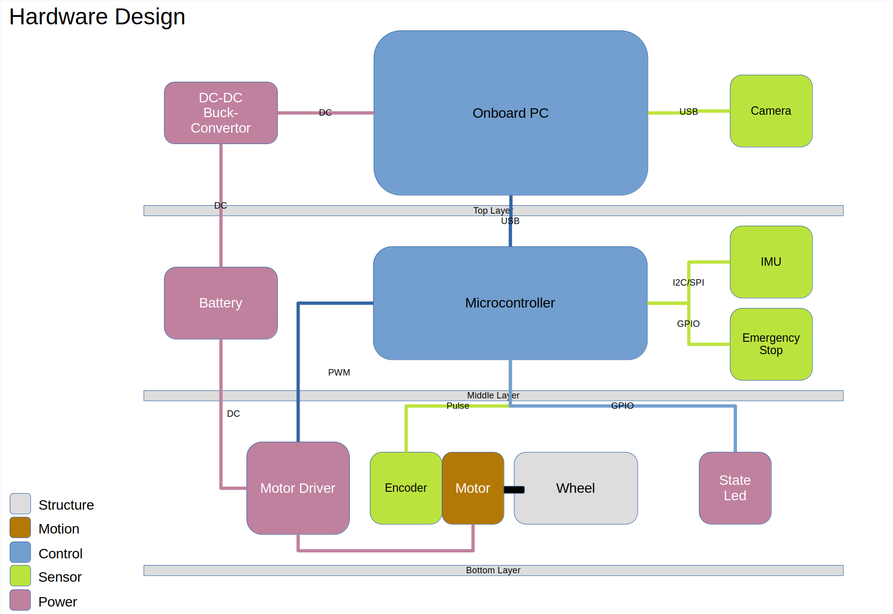
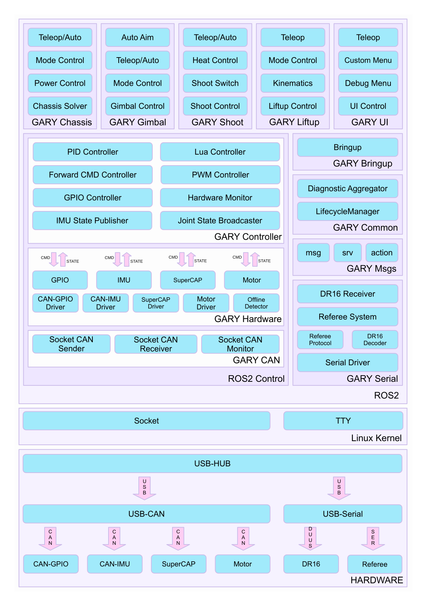
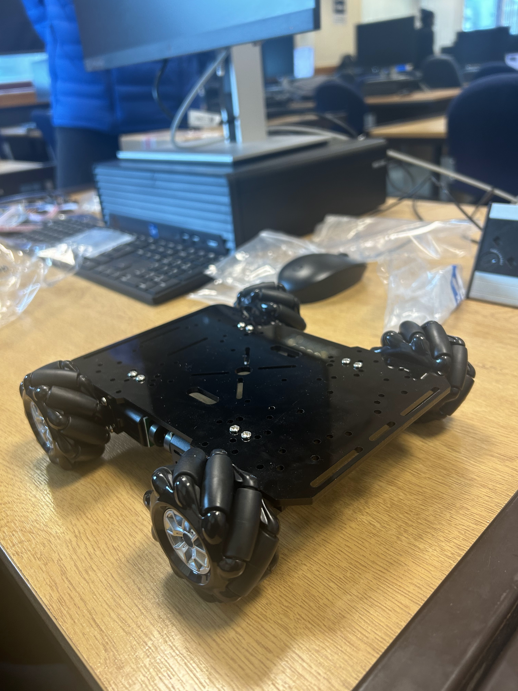
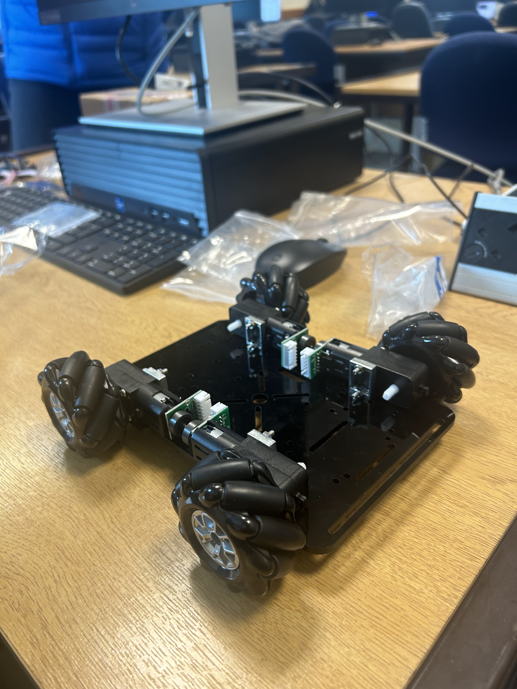
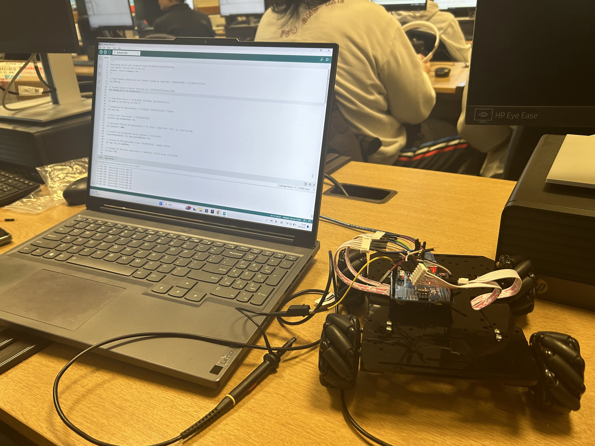
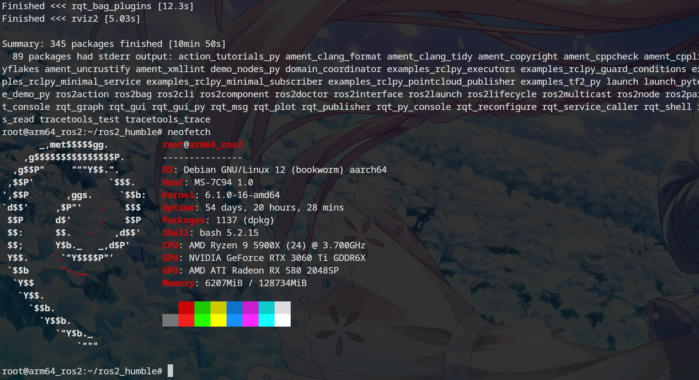
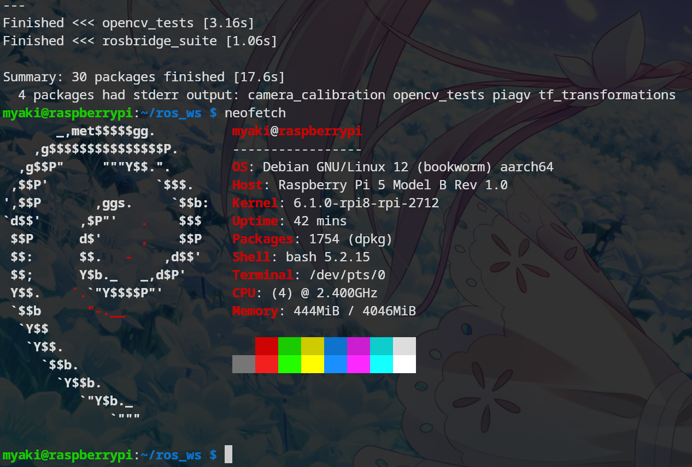

# Project Plan

## Hardware Design

Each vehicle needs components such as actuators, a brain controller, and sensors. The onboard PC can be understood as the brain, while the microcontroller can be seen as the brainstem. The brain is responsible for higher-level thinking, such as determining the robot's location, destination, and image processing tasks in this project. The brainstem is responsible for executing these commands, such as coordinating body movements. In this project, the brainstem primarily controls motor drives, reads encoders, adjusts wheel speeds, LED brightness, and other functions. The camera in the onboard PC captures images to obtain absolute coordinates; LIDAR (due to cost constraints) is not considered. The IMU (Inertial Measurement Unit) in the microcontroller can measure angles, used in this project to determine the chassis orientation. Encoders (also sensors) record wheel rotations, allowing distance calculations. Encoders and IMU provide relative coordinates. The origin depends on how it's defined; the starting point of the robot may vary. Power supply batteries require voltage conversion since the voltage required for the upper part is lower than that supplied by the batteries due to their higher voltage.

## Software Design

For this project, we only need to use a small part of it. And just add positioning and navigation function packages. To integrate positioning, we will incorporate sensor data processing modules for the selected sensors, such as LIDAR and cameras. Additionally, we'll use localization algorithms to estimate the AGV's pose accurately. This may involve utilizing SLAM techniques. For navigation, we plan to integrate ROS 2's navigation stack, particularly the `nav2` package, which provides comprehensive tools for global and local path planning. This will enable the AGV to autonomously navigate from its current location to specified goals while avoiding obstacles in real-time.

# Timeline Planning
| Week | Project Management & Doc            | Embedded                       | Software                         | Hardware         |
|------|-------------------------------------|--------------------------------|----------------------------------|------------------|
| 1    | - Timeline arrangement              | - Dev environment setup        | - Compile ROS                    | - Asm chassis    |
|      | - Week1 log                         | - Encoder code & test          | - RPI setup                      | - Test circuit   |
|      | - Components request                | - Sketch                       | - Sketch                         |                  |
| 2    | - Week2 log                         | - PWM & driver code & test     | - Camera calibration             | - Camera asm     |
|      | - Poster layout                     | - PID & filter                 | - AprilTag positioning           | - Test circuit   |
|      |                                     | - Mecanum resolve              | - Multi-tag fusion               |                  |
| 3    | - Week3 log                         | - Odom                         | - Comm                           | - Camera holder  |
|      | - Poster outline                    | - Comm                         | - Odom                           |                  |
|      |                                     |                                | - Planning                       |                  |
| 4    | - Week4 log                         | - Failsafe                     | - Comm                           | - Doc            |
|      | - Poster outline                    | - Comm                         | - Odom                           |                  |
|      |                                     |                                | - Planning                       |                  |
| 5    | - Week5 log                         | - Report                       | - Decision                       | - Report         |
|      | - Report                            |                                | - Report                         |                  |

# Hardware Part Weekly Progress
Assemble the floor plate of the model car and the splicing of the integrated circuit board, connect the circuit and test it.

# Embedded Part Weekly Progress
Primarily utilize the Arduino IDE to analyze the data collected from the preliminary assembled prototype.

Use the oscilloscopes to test that the hall encoder is working properly. Oscilloscope patterns are as expected and have been recorded.

<video style="width:100%;height:auto;" controls>
  <source src="/video/oscliscope.webm" type="video/webm">
  Your browser does not support the video tag.
</video>

# ROS Part Weekly Progress
Manually cross-compile ROS2 humble in workstation from X86_64 to ARM64

Configure the Raspberry Pi system, including Debian and ROS2, as well as the relevant project software packages (e.g., apriltag_ros).

# Problems
- There's a problem with the wiring of the two encoders (four in total).
- The code needs further refinement.

# Week 2 Plan
- Calibrate the camera and design and implement the positioning pipeline.

- Control of PID, output the PMV to drive the motor and calculate the McNamee Wheel.

- Connect and test the motherboard and establish a connection with the computer to verify the normal operation of the trolley drive.

- Layout of the poster.