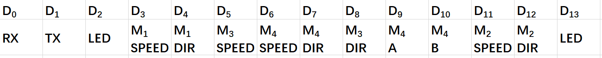
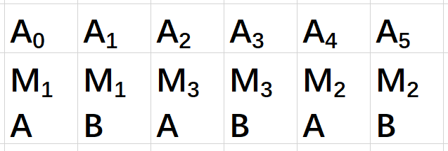
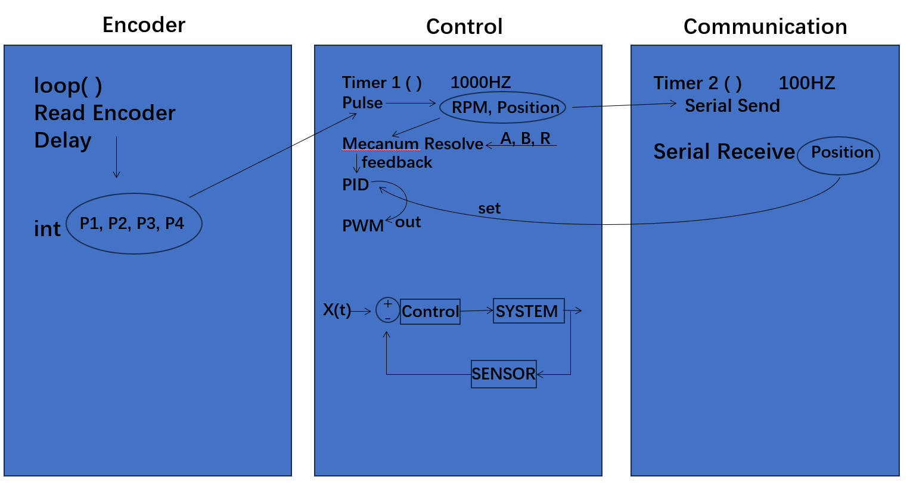
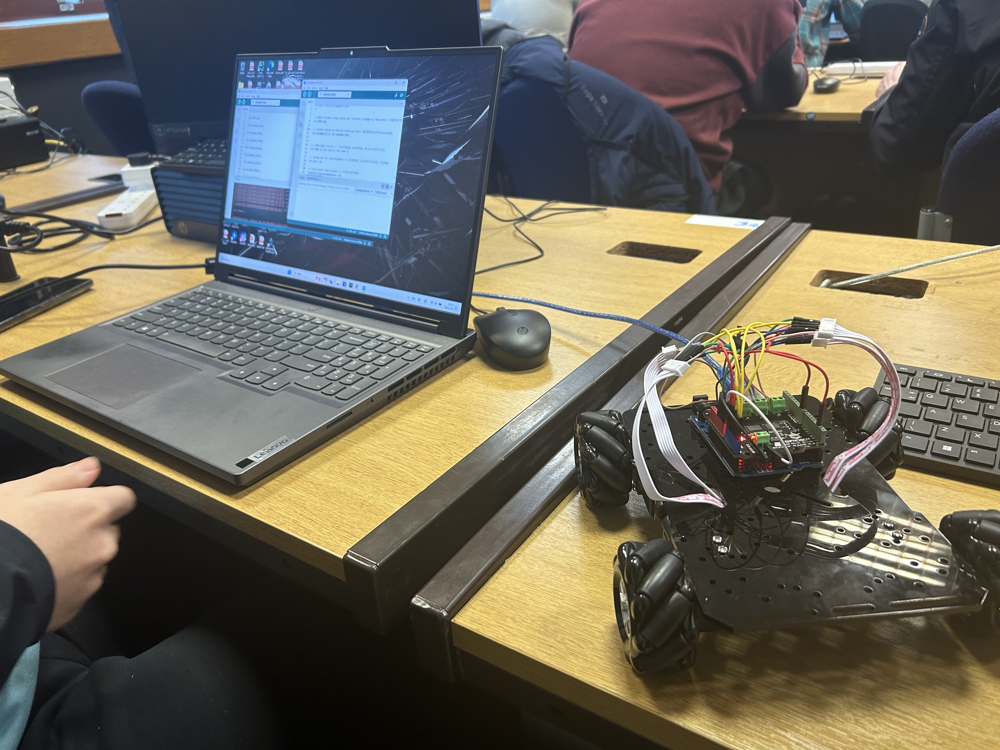
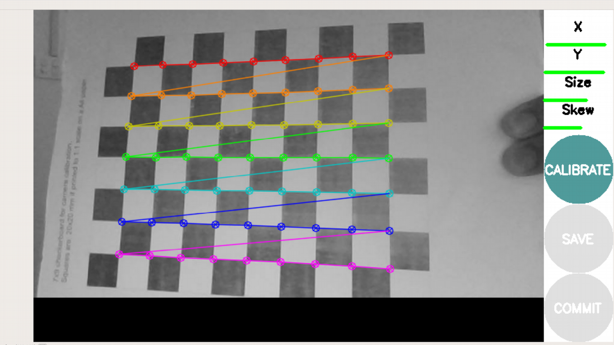
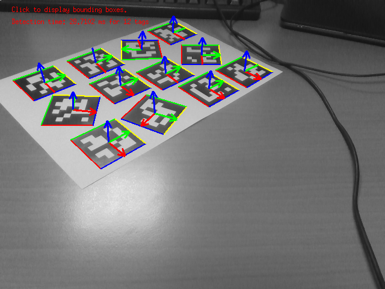

We solved the problems for week 1 and this week we will focus on how to get the vehicle to move successfully.

# Documentation Progress
- Use the App called canva to design the poster.

# Hardware Part Weekly Progress
The wiring diagram of Arduino

# Embedded Part Weekly Progress
The framework diagram of code for Arduino

Complete the code of the car drive and basic positioning system. Connect and test the motherboard, ensuring a successful connection with the computer to confirm the proper functionality of the vehicle drive.

The output from the encoder as the wheel rotates.
<video style="width:100%;height:auto;" controls>
  <source src="/video/week2-1.webm" type="video/webm">
  Your browser does not support the video tag.
</video>

Test the wheels to see if they turn properly one by one.
<video style="width:100%;height:auto;" controls>
  <source src="/video/week2-2.webm" type="video/webm">
  Your browser does not support the video tag.
</video>

Test whether all four wheels rotate properly at the same time.
<video style="width:100%;height:auto;" controls>
  <source src="/video/week2-3.webm" type="video/webm">
  Your browser does not support the video tag.
</video>

The vehicle is moving forward successfully.
<video style="width:100%;height:auto;" controls>
  <source src="/video/week2-4.webm" type="video/webm">
  Your browser does not support the video tag.
</video>

# ROS Part Weekly Progress
Using Camera calibration package to get the internal parameters of the Logitech C270 camera

Tested the apriltag detection program

# Problems
- Wheel Installation Issue: During the testing of the four wheels, we found that one of the wheels rotates in the opposite direction compared to the other wheels. We reinstalled the wheels to ensure that all wheels rotate in the same direction.

- Code Debugging: The control code underwent thorough scrutiny and refinement to ensure seamless synchronization between software control and hardware functionality.

# Week 3 Plan
- Integration of hardware and software.

- Establish communication protocols to enable computer control of the vehicle.

- Install a camera on the top of the car.

- Complete the design of the poster and start the writing of the introduction part of the poster.