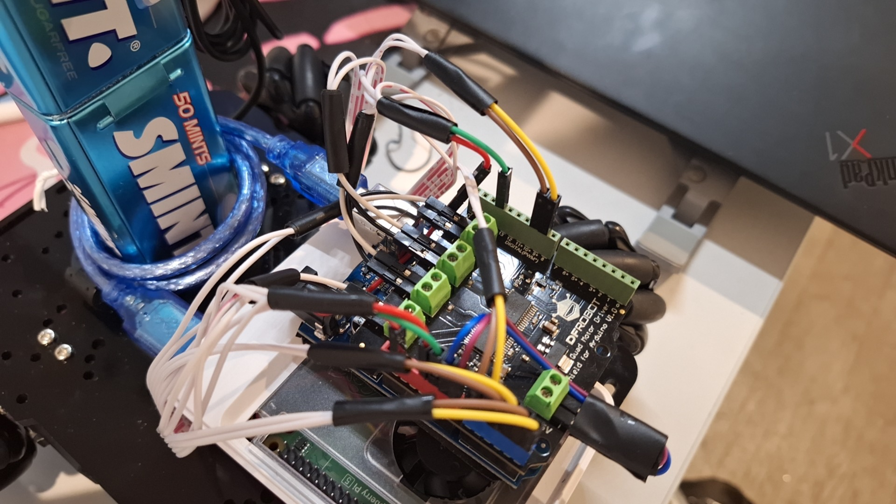
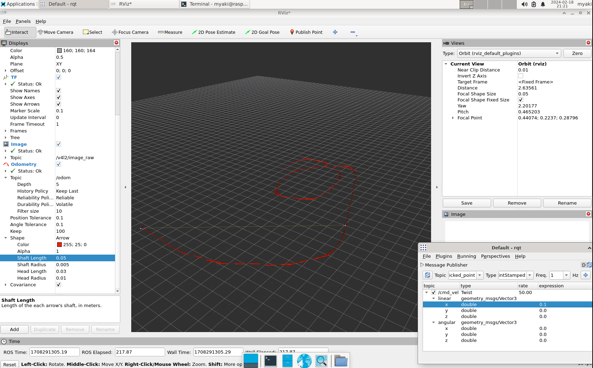
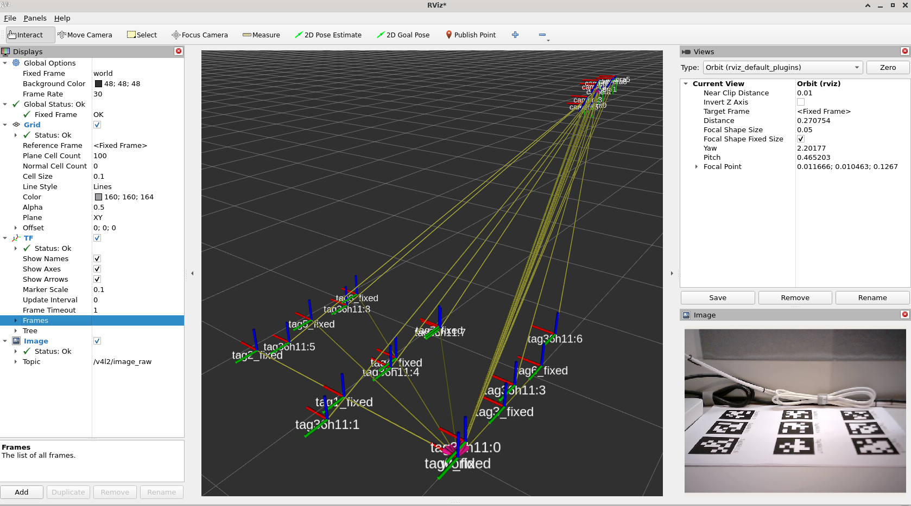
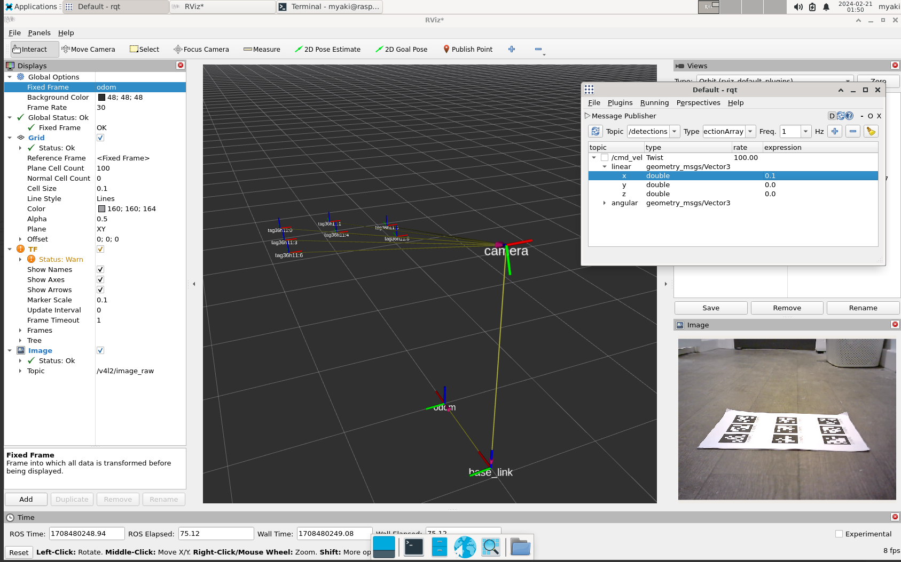

We solved the problems about week 2 and this week we will focus on managing the communication between the Raspberry Pi and Arduino, facilitating data exchange and commands transmission.  Additionally, implement path planning algorithms to generate an optimal path between two specified points.

# Hardware Part Weekly Progress
Mounting the camera onto the vehicle and optimizing the wiring of the vehicle.

| Color  | Description              |
|--------|--------------------------|
| White  | Motor positive           |
| Black  | Motor negative           |
| Brown  | Encoder phase A          |
| Yellow | Encoder phase B          |
| Red    | Encoder power supply     |
| Green  | Encoder ground           |
| Purple | Motor drive power supply |
| Blue   | Motor drive ground       |

# Embedded Part Weekly Progress
Test the vehicle to confirm whether the vehicle is capable of both lateral (sideways) and longitudinal (forward/backward) movement.

The vehicle is capable of longitudinal (forward/backward) movement
<video style="width:100%;height:auto;" controls>
  <source src="/video/week3-1.webm" type="video/webm">
  Your browser does not support the video tag.
</video>

The vehicle is capable of lateral (sideways) movement
<video style="width:100%;height:auto;" controls>
  <source src="/video/week3-2.webm" type="video/webm">
  Your browser does not support the video tag.
</video>

# ROS Part Weekly Progress
Localization test (oodometry only)

Localization test (camera only)

Localization test (camera odom fusion)

# Week 4 Plan
- Complete the design of the poster and print it out.

- Securing and bundling wires on the cart to ensure circuit safety.

- Deal with the problems left for the first three weeks about the code and the circuit.

- Prepare for the bench Inspection.