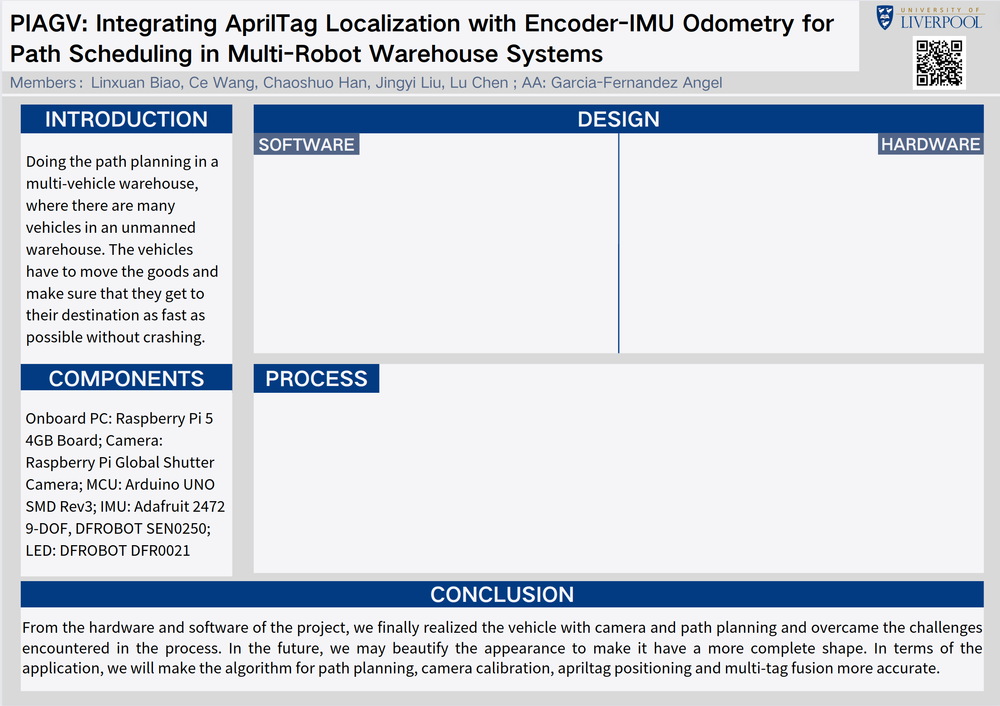
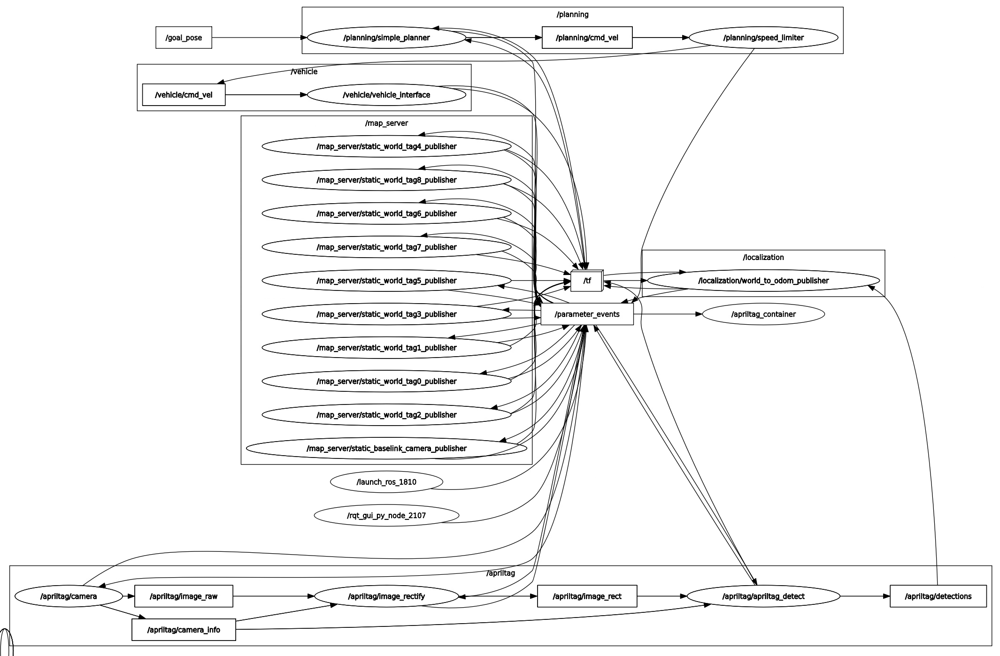

After three weeks of work, we have completed the majority of the project. This week, our focus is primarily on finishing up some supplementary tasks.

# Documentation Progress
First poster draft

# Hardware Part Weekly Progress
- Securing and bundling wires on the cart to ensure circuit safety.

# Embedded Part Weekly Progress
- Adding failsafe function in case of program failure or emergency

# ROS Part Weekly Progress
ROS program node graph

Final video demonstrates the full process of decision making, localization, path planning and communication
<video style="width:100%;height:auto;" controls>
  <source src="/video/week4-1.webm" type="video/webm">
  Your browser does not support the video tag.
</video>